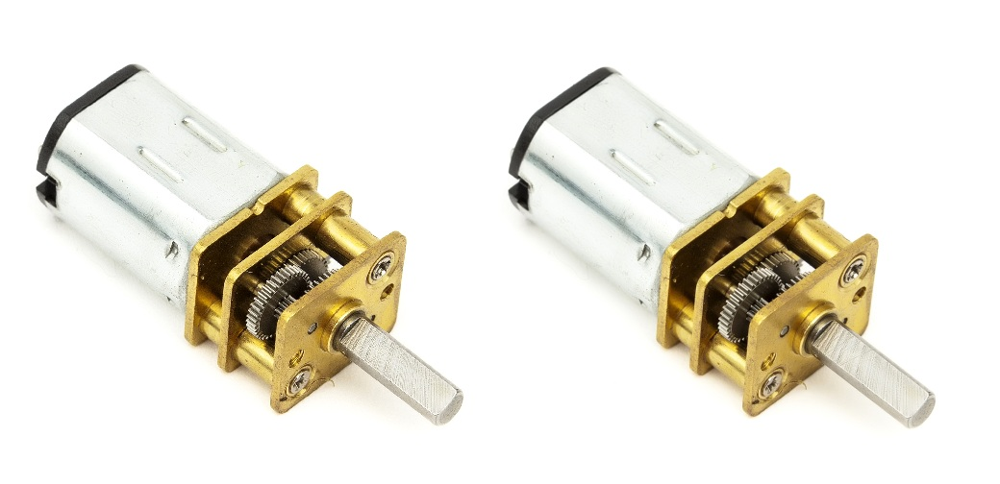
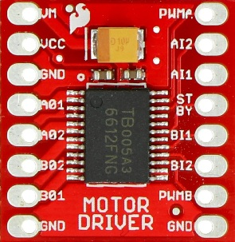
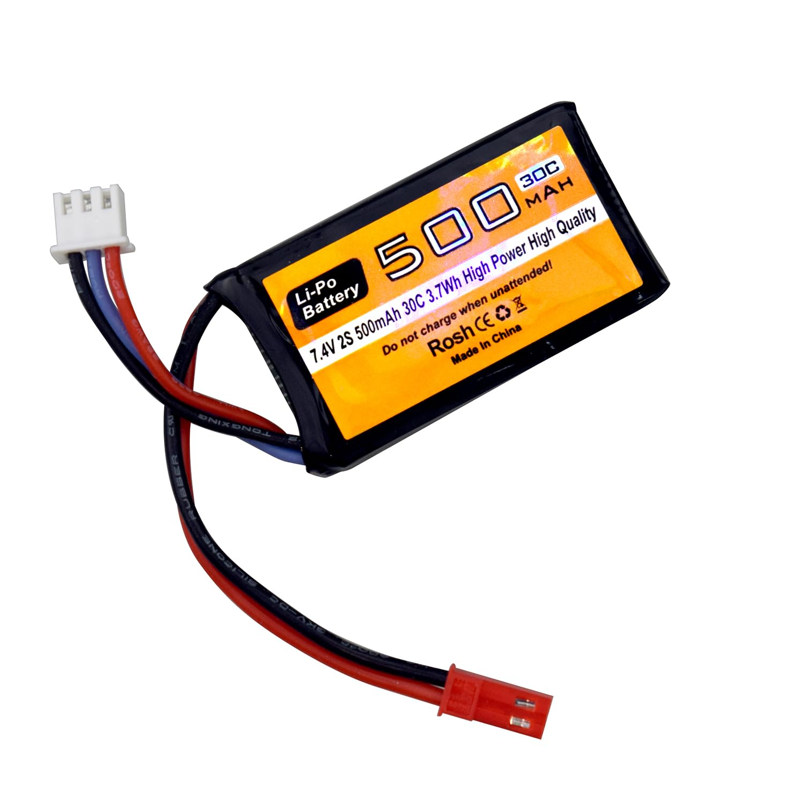
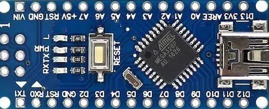

# Projeto Robô Seguidor de Linha
César Augusto Victor — Mestrando em Engenharia Elétrica e de Computação (UFC Sobral)
📧 cesartri2012@gmail.com

<!-- Badges de Documentação -->

---

Este repositório apresenta um **projeto completo de um robô seguidor de linha**, eficiente e de baixo custo, ideal para estudantes, iniciantes em robótica móvel e entusiastas que desejam entender os fundamentos desse tipo de sistema.

O projeto foi inteiramente desenvolvido no **Proteus 8.12**, incluindo sensores, controle, drivers e motorização.

---

## 📦 Sobre este Repositório

Este repositório contém **apenas os arquivos dos componentes, esquemáticos, layout e placa do Proteus**, permitindo que qualquer pessoa possa:

- Visualizar o circuito completo  
- Editar e simular no Proteus 8.12  
- Fabricar sua própria PCB  
- Estudar o hardware utilizado no robô  

⚠ **IMPORTANTE:**  
O repositório **NÃO** contém o código-fonte do robô.  
O firmware está disponível separadamente em:

👉 **Repositório do Código (QTR Genérico):**  
https://github.com/cesarauugusto/QTR_Sensor_Generico

---

## ⚙️ Download do Proteus 8.12

Para executar a simulação, utilize o Proteus 8.12.  
Você pode baixar e instalar através do link abaixo:

👉 **Download Proteus 8.12:**  
https://drive.google.com/drive/folders/16IOtGxkFPdnRsD6lFqEz00AhovXTidr-?usp=drive_link

---

## 🧩 Componentes Utilizados

---

### 🔌 Sensor QTR  
  

---

### ⚙️ Motores  
  

> O motor utilizado foi o **Micro Metal GearMotor MP 6V**, com velocidade de **3000 RPM**, caixa de redução **10:1** e corrente de **0,67 A**.  
> Para iniciantes, recomenda-se motores entre **1000 e 2000 RPM**, o que facilita o controle.

---

### 🔧 Ponte H – TB6612FNG  
    

> O driver **TB6612FNG** possui dois canais, suporta até **13V**, e fornece picos de até **3A por canal**, sendo ideal para pequenos robôs seguidores de linha.

---

### 🔋 Bateria LiPo  
 

> Utilizada uma bateria **LiPo Zippy 7,4V – 500 mAh**, modelo ideal por sua leveza e alta capacidade de descarga.

---

### 🧠 Arduino Nano  
  

> O **Arduino Nano** foi escolhido por ser compacto, leve e programável via USB.  
> Os pinos analógicos A0–A7 foram utilizados para leitura dos sensores.

---

## ⚡ Velocidade Recomendada dos Motores
- Ideal: **1000–2000 RPM**
- Motores acima de 3000 RPM requerem controle mais avançado
- Motores mais lentos são mais estáveis

---

## 📄 Artigos e Referências

📘 **Artigo nos Anais da SENGI 2020:**  
https://www.even3.com.br/anais/sengi2020/271818/

📗 **Publicação no E-book "Gestão Empresarial – Teoria e Prática":**  
https://web.archive.org/web/20201209112322id_/https://www.uniedusul.com.br/wp-content/uploads/2020/10/E-BOOK-GESTAO-EMPRESARIAL-TEORIA-E-PRATICA.pdf#page=28

> Alguns trechos deste README foram extraídos e adaptados do artigo do autor.

---

## 💻 Código do Robô

👉 **Repositório do Código (QTR Genérico):**  
https://github.com/cesarauugusto/QTR_Sensor_Generico

---
